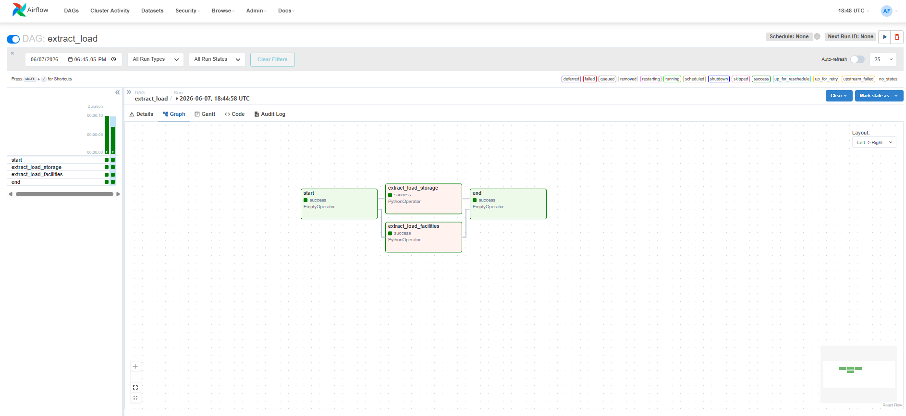
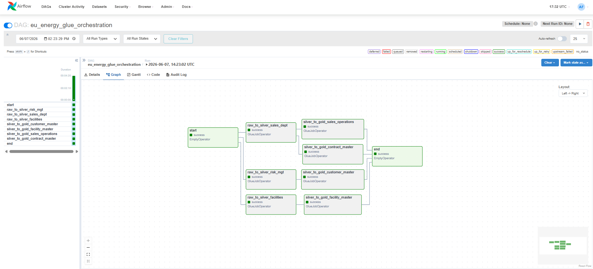

# EU Energy Storage Platform


          AGSI+ API
               |
               v
       Python Extractor
               |
               v
            AWS S3
          (Raw Layer)
               |
               v
         AWS Glue ETL
         (PySpark)
               |
               v
            AWS S3
        (Silver / Gold)
               |
               v
          Snowflake
      Raw → Clean → Mart
               |
               v
             dbt
               |
               v
          Power BI
          

      Orchestration: Apache Airflow
      Monitoring: CloudWatch
      CI/CD: GitHub Actions


An enterprise-style cloud data engineering platform that simulates real-world energy storage operations, customer risk management, sales operations, and contract management workflows using AWS, Spark, Snowflake, dbt, and Apache Airflow.

## Project Overview

This project was designed to simulate how a modern energy company could centralize fragmented operational and commercial data into a scalable cloud-based lakehouse platform.

The platform ingests structured and unstructured datasets from multiple simulated business departments including:

* Risk Management
* Sales Operations
* Facilities Management
* Contract Management

The project implements a medallion architecture approach:

```text
Raw Layer     → Source ingestion
Silver Layer  → Cleaned and standardized Parquet datasets
Gold Layer    → Business-ready master tables
```
---

## Key Achievements

* Built an end-to-end cloud data platform using AWS, Snowflake, dbt, and Apache Airflow
* Implemented Snowflake RBAC, warehouse isolation, and governance controls
* Implemented medallion architecture across four business domains
* Implemented AWS Glue-based medallion processing across 11 Silver datasets and 4 Gold master tables
* Created automated orchestration for RAW → SILVER → GOLD processing
* Designed dimensional models and business marts for analytics consumption
* Implemented CI/CD, testing, governance, and warehouse isolation strategies

---

## Platform Statistics

```text
* 4 Business Domains
* 11 Silver Datasets
* 4 Gold Master Tables
* 2 Airflow DAGs
* 4 Snowflake Warehouses
* 3 Dimension Models
* 1 Fact Model
* 3 Business Marts
* 1 SCD Type 2 Snapshot
```

---

# Architecture

## Technologies Used

* Python
* AWS S3
* AWS Glue
* AWS Glue Jobs
* AWS Glue Data Catalog
* AWS IAM
* PySpark
* Snowflake
* Snowflake RBAC
* dbt
* Apache Airflow
* Docker
* GitHub Actions
* Pytest
* Parquet
* Medallion Architecture

---

# Data Domains

## Risk Management Domain

Datasets:

* credit_worthiness
* customer_contacts
* risk_management

Gold Output:

* customer_master_table

Business Goal:
Create a unified customer risk and exposure view.

---

## Facilities Domain

Datasets:

* storage_facilities
* facility_maintenance
* imbalance_events

Gold Output:

* facility_master_table

Business Goal:
Create a facility operational and maintenance overview.

---

## Sales Operations Domain

Datasets:

* capacity_bookings
* nominations
* gas_prices

Gold Output:

* sales_operations_table

Business Goal:
Combine booked capacity, operational nominations, and market gas pricing into a unified operational analytics layer.

---

## Contract Management Domain

Datasets:

* contracts
* contract_capacity

Gold Output:

* contract_master_table

Business Goal:
Create a centralized contract and capacity allocation master dataset.

---

# S3 Lakehouse Structure

```text
s3://eu-energy-platform/

raw/
silver/
gold/
```

---

# Current Gold Tables

```text
gold/
├── customer_master_table/
├── facility_master_table/
├── contract_master_table/
└── sales_operations_table/
```

---

# Current Features

### Data Engineering

* Multi-domain enterprise data modelling
* Raw → Silver → Gold medallion architecture
* Spark transformations with AWS Glue
* Parquet standardization
* Business-oriented master table creation
* Realistic enterprise join scenarios

### Snowflake

* External stage integration
* Schema inference with INFER_SCHEMA
* COPY INTO ingestion
* RAW/CLEAN architecture
* RBAC implementation
* Warehouse isolation strategy

### Analytics Engineering

* dbt staging models
* Dimension models
* Fact models
* Business marts
* Snapshots (SCD2)
* Data tests
* Documentation generation

### Orchestration & DevOps

* Apache Airflow orchestration
* AWS Glue Job Operator integration
* Dockerized execution environment
* GitHub Actions CI pipeline
* Pytest unit testing
* Config-driven architecture

---


# Airflow Orchestration

Implemented Components:

* Apache Airflow 3.x
* Dockerized Airflow environment
* DAG: `extract_load`
* DAG: `eu_energy_glue_orchestration`
* PythonOperator integration
* AWS Glue Job Operator integration
* Dependency-based workflow orchestration
* Parallel execution of independent domains
* DAG monitoring and execution tracking
* Manual and schedule-based execution support

Implemented DAGs:

### `extract_load`





Purpose:

Extract operational storage data from AGSI+ API endpoints and load raw JSON datasets into AWS S3 for downstream processing.

Workflow:

```text
Start
    ↓
Extract Storage Data
    ↓
Extract Facility Data
    ↓
Load Raw JSON to S3
    ↓
End
```

---

### `eu_energy_glue_orchestration`



Purpose:

Orchestrate AWS Glue jobs that transform raw datasets into standardized Silver datasets and business-ready Gold master tables.

Workflow:

```text
Start
        ↓

RAW → SILVER
├── Risk Management
├── Sales Operations
└── Facilities

        ↓

SILVER → GOLD
├── Customer Master
├── Facility Master
├── Sales Operations
└── Contract Master

        ↓

End
```

---

Business Goal:

Automate and orchestrate the complete end-to-end data platform workflow, from API data extraction through medallion transformations, ensuring task dependencies, monitoring, scalability, and production-ready scheduling.

---


# Snowflake Data Warehouse Layer

Implemented Components:

* External stages connected to AWS S3
* Storage integration using IAM role-based access
* Parquet file ingestion
* Raw layer modelling
* Clean layer modelling
* Schema inference with `INFER_SCHEMA`
* `COPY INTO` ingestion pipelines
* Analytics schema separation
* Snapshot schema for historical tracking
* Role-Based Access Control (RBAC)
* Dedicated warehouses for workload isolation
* User, role, and warehouse governance
* Compute resource management and scaling strategies
* Fine-grained database, schema, and table-level access control

# Current Snowflake Architecture:

```text
AWS S3 (Gold Layer)
        ↓
Snowflake Stage
        ↓
RAW Schema
        ↓
CLEAN Schema
        ↓
ANALYTICS Schema
        ↓
SNAPSHOTS Schema
```

Security & Governance Architecture:

```text
Users
        ↓
Roles
        ↓
Warehouses
        ↓
Database Access
        ↓
Schema Access
        ↓
Table/View Access
```

Compute Architecture:

```text
sales_analyst_wh
        ↓
Sales Reporting & Analytics

risk_analyst_wh
        ↓
Risk Analysis & Monitoring

ml_ai_team_wh
        ↓
Machine Learning & Advanced Analytics
```

---

## Warehouse Strategy

Implemented Components:

* Dedicated warehouses for workload isolation
* Team-specific compute resource allocation
* Role-based warehouse access control
* Auto-suspend and auto-resume for cost optimization
* Warehouse sizing based on workload requirements
* Foundation for future multi-cluster scaling

Current Warehouse Design:

```text
COMPUTE_WH
        ↓
Administrative & Development Activities

SALES_ANALYST_WH
        ↓
Sales Reporting & Dashboard Analytics

RISK_ANALYST_WH
        ↓
Risk Monitoring & Contract Analytics

ML_AI_TEAM_WH
        ↓
Machine Learning & Advanced Analytics
```

---

# dbt Integration

Implemented Components:

* dbt project initialization
* Snowflake profile configuration
* Analytics schema integration
* Staging layer models
* Dimension models
* Fact models
* Business marts
* Data quality tests
* Data lineage generation
* Documentation generation
* SCD Type 2 snapshots

Current Models:

```text
ANALYTICS

STAGING
├── STG_CONTRACT_MASTER
├── STG_CUSTOMER_MASTER
├── STG_FACILITY_MASTER
└── STG_SALES_OPERATIONS

DIMENSIONS
├── DIM_CONTRACT
├── DIM_CUSTOMER
└── DIM_FACILITY

FACTS
└── FACT_SALES_OPERATIONS

MARTS
├── CUSTOMER_RISK
├── FACILITY_UTILIZATION
└── CONTRACT_ANALYTICS
```

Current Snapshots:

```text
SNAPSHOTS
└── SNAP_CUSTOMER_MASTER
```

### Business Goal:

Create reusable, tested, documented, and historically traceable analytical models for downstream reporting, risk management, and business intelligence.

---

# Testing Strategy

Implemented Components:

* Pytest unit testing
* Mocking with pytest-mock
* AWS API call mocking
* Configuration mocking
* CI validation through GitHub Actions

### Business Goal:

Ensure pipeline reliability, testability, and maintainability through automated validation of extraction and transformation logic.

--- 


# Current Data Platform Architecture

```text
API / Departmental Data Sources
                ↓
AWS S3 Raw Layer
                ↓
Apache Airflow
                ↓
AWS Glue (RAW → SILVER)
                ↓
AWS S3 Silver Layer
                ↓
AWS Glue (SILVER → GOLD)
                ↓
AWS S3 Gold Layer
                ↓
Snowflake Stage
                ↓
RAW Tables
                ↓
CLEAN Tables
                ↓
dbt Staging Models
                ↓
Dimensions & Facts
                ↓
Business Marts
                ↓
Snapshots (SCD2)
                ↓
Power BI Dashboards
```

---

# CI/CD

Implemented Components:

* GitHub Actions workflow
* Automated pytest execution
* Dependency validation
* dbt project validation

---

# Future Enhancements

## Expanded Airflow Orchestration

Future improvements will include:

* Scheduled production execution (@daily, cron scheduling)
* Email and Slack alerting
* Dynamic task generation
* Data quality validation tasks
* Event-driven workflows
* Cross-DAG orchestration

---

## Snowflake Automation

Future support for:

* Snowflake Tasks
* Snowpipe Auto-Ingest
* Automated refresh pipelines
* Metadata-driven ingestion

---

## PDF Processing Pipeline

Future support for:

* AWS Textract
* Contract metadata extraction
* Document intelligence workflows

## Power BI Dashboards

Planned analytical dashboards for:

* Customer risk exposure
* Facility operations
* Commercial sales operations
* Contract analytics
* Storage utilization analytics

## Advanced CI/CD

Future support for:

* Automated dbt deployment pipelines
* Snowflake environment promotion
* Infrastructure validation
* Production release automation

## Data Governance

Future support for:

* Data masking policies
* Row-level security
* Data catalog integration
* Data Lineage automation
* Data Quality monitoring
